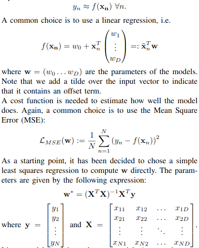
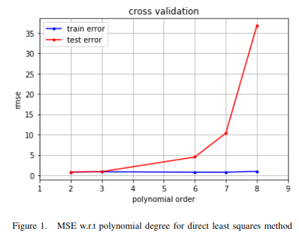

# Higgs Boson Detection

### Abstract—
**At CERN, the direct observation of Higgs bosonsis impossible due to their short life. Instead, one can deter-minate whether a proton collision generates a Higgs boson byanalysing the decay. A good way to process this huge amount ofdata and create a prediction model is to use machine learningtechniques. In this work we present how we build a model thatcombines a least squares regression and a Ridge regularizationin order to best predict whether a given set of data is due tothe creation of a Higgs boson.**

## 1. Introduction
The  Higgs  boson  is  an  elementary  particle  discoveredat  the  Large  Hadron  Collider  at  CERN  in  2013.  In  orderto  produce  it,  physicists  accelerate  protons  and  make  themcollide  at  high  speeds.  In  some  rare  cases,  the  collisiongenerates a Higgs boson. A major problem that arises whenscientists  want  to  observe  the  particle  is  that  its  life  isvery short. Indeed, a Higgs boson quickly decays into otherparticles. For that reason, it is observed indirectly by lookingat  the  outputs  of  the  decay.  However,  this  process  can become tricky because a Higgs boson’s decay signature canbe very much alike another particle’s signature.In  this  paper,  a  machine  learning  method  that  efficiently estimates  the  likelihood  that  a  given  measurement  is  dueto  a  Higgs  boson  or  some  other  particles  is  presented.  It combines a least squares method augmented with a polyno-mial basis along with a Ridge regularization.Two  specific  data  sets  are  used  to  optimize  the  method.The  first  setStis  called  the  training  set  and  contains N=250000 observations. It is used to develop the model.The  second  setSvis  the  validation  set  and  has  568238 events. These data are used to validate the model and make sure  that  we  the  model  does  not  overfit  the  data  of St.  Inboth sets, the events are characterized by 30 features. Amongthem,  13  are  ”raw”  quantities  about  the  bunch  collision  asmeasured  by  the  detector  and  17  are  ”derived”  quantitiescomputed  from  the  raw  features,  which  were  selected  bythe physicists. Finally, let’s point out that in some cases thevariables of some entries are not available. In order to handlethe  missing  data,  it  is  primordial  to  apply  a  preprocessing stage.

## 2. Methodology
Before  digging  into  prediction  methods,  it  is  beneficialto  handle  the  data.  The  preprocessing  is  key  and  impactsthe  prediction.  For  instance,  a  scatter  plot  matrix  of  each features can be useful to select or drop some features. In ourcase,  a  basic  standardization  by  subtracting  the  mean  and dividing  by  the  standard  deviation  is  applied  to  the  inputdata.  Furthermore,  the  missing  value  are  replaced  by  themean  of  the  corresponding  feature,  which  is  better  than  avalue which has no signification. This will be referred to assimple  preprocessing.  In  a  second  phase,  the  positive  data are replaced by the log of their inverse, i.e.log(1/1+x)before the standardization. Taking the log is a common technique.In  this  case,  it  makes  sure  that  all  the  values  are  negative.This will be referred to as complex preprocessing.To predict the nature of the measurement, we need to find a function that best approximates the outputywith the given inputs x

Linear models are inherently not very rich. A way to increasetheir representational power it boost the inputs by adding apolynomial basisφ(xn)of arbitrary degreeM. We then fita linear model to the extended feature vector:

yn≈φ(xn)Tw.

Unfortunately, this tuning has a negative effect: overfitting. Regularization is a way to mitigate this undesirable behavior  by  penalizing  the  model  with  a  parameter Ω(w).  The optimization problem becomes

## 3. Results
For each prediction methods, the training set is split in 2 random subsets. The first one has 3/4 of the data and is usedas a proper training set whereas the rest goes into a testing set to avoid overfitting. As a baseline, a simple least together with a polynomial basiswith  different  degrees  and  a  simple  preprocessing  is  used.As it can be seen on Fig.1, it is obvious that the polynomial basis does not bring much. However, not every polynomial basis can be used because some basis lead to an unsolvable olution, that’s the reason why some points are missing onthe figure.  

Secondly, the Ridge regularization is added. The first task isto tune the hyperparameterλ′. It is found by cross validationthat a value ofλ′= 0.0001yields better predictions.Finally,  when  a  complex  preprocessing  (log  of  inverse)  isused, along with a least squares and a Ridge regularization,it  yields  the  Fig.2.  It  shows  that  an  order  of  8  is  optimalbecause a higher degree clearly overfits the testing set.   .A  summary  of  the  results  can  be  found  in  table  II.  Notethat selecting raw or the derived features only gives a lowerscore than taking into consideration both types, even if thereis information redundancy by taking both types.

## 4. Discussion

There  are  few  things  that  can  probably  be  improved  inorder  to  get  better  prediction.  Firstly  MSE  is  not  a  goodcost  function  when  outliers  are  present  which  is  the  casehere. One should thus look for another cost function. Then, least  squares  is  a  pretty  basic  model.  The  next  step  would be  to  use  a  logistic  regression  instead.  However,  we  couldnot manage to make it converge.Regarding   preprocessing,   an   improvement   would   be   to weight  the  features  independently  instead  of  having  themequally  weighted.  Moreover,  there  is  a  feature  which  onlyhas integer numbers. A possible improvement would be notto feed it to the polynomial basis and use this feature directly.Unfortunately, this trick has not shown much improvementon the final score. Finally, when the preprocessing changedfrom  simple  to  complex,  the  whole  optimization  process should be done again to guarantee the best prediction with the appropriate hyperparameters.

## 5. Summary

In  this  work  we  have  shown  that  one  can  have  a  fairlygood  prediction  using  simple  machine  learning  techniqueslike the least squares regression and the ridge regularizationas long as one takes care of handling the data properly. Wehave  also  highlighted  the  fact  that  in  the  field  of  machinelearning, one should be careful and that some intuition thatseem good a priori yield worse prediction.

[full report pdf](HiggsBoson_detection/report/bazinga-submission.pdf)

